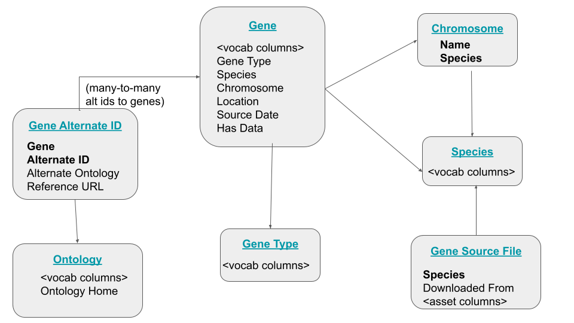

These steps will create and populate a set of gene-related tables.



## Initial Setup

1. Create a config file with the names of schemas and tables, etc. (see facebase_gene_defaults.csv for an examle).

2. Create a new scratch database to be used for etl (data will be loaded into this database, transformed, and dumped into csv tables for loading into the ermrest db)

3. Create new tables with create_tables.py:

python3 create_tables.py <host> <config_file> <curie_prefix>

this should be pretty obvious -- <host> is the host you want to act on,
<config_file> is the file you created in step 0, and
<curie_prefix> is the prefix for curies for vocabulary terms you create

If some of these tables exist, there are options to skip creating them (python3 create_tables.py --help
to list them all)

## Data import / update

To import gene info for a species:

1. Make sure your species table has entries for that species. The ID column for each species should have an NCBI Taxon identifier (e.g., `NCBITaxon:10090`)

2. Add (or update) the data:

```
sh load-gene-table.sh <host> <config-file> <species> <source_url>
```

For example:

```
sh load-gene-table.sh dev.facebase.org facebase_gene_defaults.json "Homo sapiens" \
   ftp://ftp.ncbi.nih.gov/gene/DATA/GENE_INFO/Mammalia/Homo_sapiens.gene_info.gz
```

## Config file

These are the definitions for all the parameters in the config file (see also the [facebase config file](./facebase_gene_defaults.json) for an example).

| name | value |
| ---- | ----- |
| scratch_db : scratch database to be used for etl |
| scratch_directory | scrach directory to be used for etl |
| database | database used by the ermrest catalog |
| catalog_id | ermrest catalog id |
| hatrac_parent | parent directory for local copies of gene source files |
| species_schema, species_table | where to find/create the species table |
| chromosome_schema, chromosome_table | where to find/create the chromosome table |
| gene_type_schema, gene_type_table | where to find/create the gene type (with terms like "protein coding", etc.) |
| gene_schema, gene_table | where to find/create the gene table |
| dbxref_schema, dbxref_table | where to find/create the dbxref (alternate ids) table |
| source_file_schema, source_file_table | where to find/create the table with information about source files (e.g., NCBI tarballs) for each species) |
| ontology_schema, ontology_table | where to find/create the table with information about ontologies used in the dbxref (alternate id) table |


