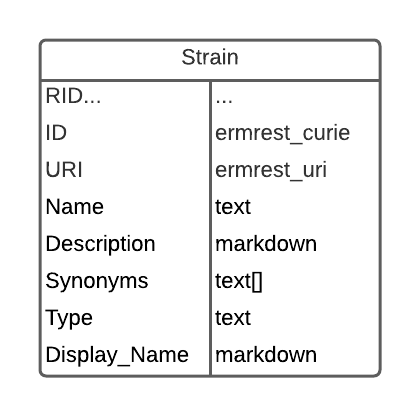

# Strain Tools

Instructions and scripts for creating and loading a "vocabulary" like table based on MGI mouse strain data into a DERIVA catalog.

The model consists of a single table based on the standard deriva-py vocabulary template with the additions of `Display_Name` for markdown-formatted strain names and `Type` for MGI mouse strain types. The configuration file can be used to customize the name of the columns in the table.



## Mouse Strain Data

First, get the [Official Strain Nomenclature (tab-delimited)](http://www.informatics.jax.org/downloads/reports/MGI_Strain.rpt) and/or the [Unreviewed Nonstandard Mouse Strain and Stock Nomenclature (tab-delimited)](http://www.informatics.jax.org/downloads/reports/MGI_Nonstandard_Strain.rpt) report(s) from the [MGI Data and Statistical Reports](http://www.informatics.jax.org/downloads/reports/index.html) site. See the associated [WARRANTY DISCLAIMER AND COPYRIGHT NOTICE](http://www.informatics.jax.org/mgihome/other/copyright.shtml).

## Configuration File

You will need to create a configuration file used by the strain tools. The configuration file is used during initial setup and data imports to map the general expected structure of the strain table to the deployment specific catalog schema. See this [example configuration file](./strain_config.json).

| Name | Required? | Value |
|------|-----------|-------|
| schema | Y | The schema name of the strain table. |
| table | Y | The name of the strain table. |
| curie_template | M | Required only if the table must be created. |
| uri_template | N | Used only if the table must be created. If not given, the default `"/id/{RID}"` value will be used. |
| mgi_uri_template | N | Used to populate the `URI` column with an MGI-specific URI. You may enter any text template with `{MGI_ID}` as the token to replace with the MGI ID for the strain. By default, it will use `"http://www.informatics.jax.org/strain/{MGI_ID}"`. |
| column_map | N | Mapping from expected column names to alternate names (e.g., lowercase instead of title case column names). Property names of `column_map` include `ID`, `URI`, `Name`, `Description`, `Display_Name`, and `Type`, which are also the default column names for the Strain table. The values of its properties should be a single text string to be used as the alternate form of the respective column name. |

## Create Table

The `create_table.py` script creates or alters the Strain table.
* **Create Mode**: if the Strain table does not exist, the script will create a table using the default definitions for a `deriva-py` vocabulary plus the additional columns `Type` and `Display_Name`. Do not include the `column_map` property in your configuration as the script will require that you use the default naming convention.
* **Alter Mode**: if the Strain table does exist, it must have all conventional "vocabulary" columns. The `column_map` may be used in this case. The script will first confirm that all conventional "vocabulary" columns exist. Then it will alter the table and add the non-standard columns (`Type` and `Display_Name`). It will use the `column_map` entry so that you may follow your preferred naming convention. It will not add any other columns nor will it delete any extraneous columns.

Usage:
```shell
$ python create_table.py [-h|-n|-v] <hostname> <catalog_id> <config_file>
```

## Load MGI Data

The `load_mgi_data.py` script reads and parses the [MGI mouse strain report](#mouse-strain-data) and then inserts rows into the Strain table. The 'Strain Name' from the MGI report will be used as the `Name` value, and then it will be markdown-formatted by replacing superscript begin and end markers, `<` and `>` respectively, with the DERIVA-supported superscript character `^` and used as the `Display_Name` value. The script naively attempts to insert the entire set of rows in a single transaction, which will most likely exceed the default gateway timeout on the server.

Usage:
```shell
$ python load_mgi_data.py [-h|-n|-v] <hostname> <catalog_id> <config_file> <data_file>
```
